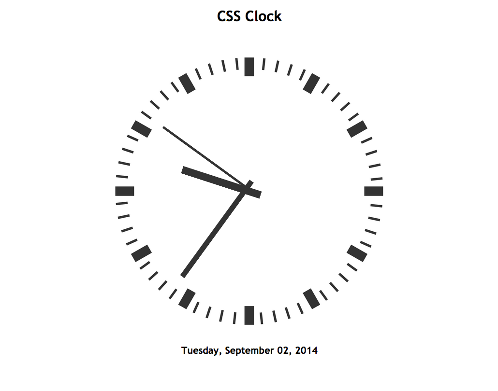

# CSS Clock [v3.0]
***

`CSS Clock` was one of my early forays into CSS and JS. At the time (2010) there were only flash clocks, and I needed a CSS/JS based one, since I used this element in a personal tool on my iPod Touch. In the process of making this, I also had a chance to learn photoshop.

### Screenshot

### Usage

Extract this directory to a location of your choice, and embed the code where needed.

#### License

`CSS Clock` is licensed with GPL

#### Contributors

Ivan Smirnov
